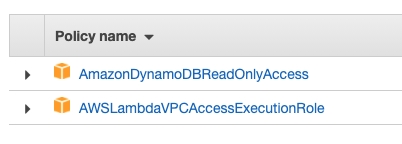

# Developing evolutionary architecture with AWS Lambda

## Context
Agility enables you to evolve a workload quickly, adding new features, or introducing new infrastructure as required. The key characteristics for achieving agility in a code base are loosely coupled components and strong encapsulation.

Loose coupling can help improve test coverage and create atomic refactoring. With encapsulation, you expose only what is needed to interact with a service without revealing the implementation logic.

Evolutionary architectures can help achieve agility in your design. In the book [“Building Evolutionary Architectures”](https://learning.oreilly.com/library/view/building-evolutionary-architectures/9781491986356/), this architecture is defined as one that “supports guided, incremental change across multiple dimensions”.

If you are interested to learn more about this approach, please read the [blog post associated to this code example](https://aws.amazon.com/blogs/compute/developing-evolutionary-architecture-with-aws-lambda).

## Project
This example provides an idea on how to implement a basic hexagonal architecture with [AWS Lambda](https://aws.amazon.com/lambda/).    
The folder structure represents the three key elements that characterizes the first implementation of an hexagonal architecture: ports, adapters and domain logic.

In order to run the project in your AWS account, you have to follow these steps:

1. We need a 3rd party service to retrieve real-time currencies value for this example, you can use a service like [fixer.io](https://fixer.io/), Create a free account and get the API Key used for consume the API

2. Download [AWS SAM](https://aws.amazon.com/serverless/sam/) and change the API_KEY property in the ```template.yaml``` file (present in the root folder) with the Fixer.io API key

3. Then in the ```adapters/CurrencyConverter```, you have to replace the basepath with the URL provided by the service this line of code:

from this:
```
const res = await axios.get(`http://api.mysite.com?access_key=${API_KEY}&symbols=${currencies.toString()}`)
```

to this:
```
const res = await axios.get(`http://data.fixer.io/api/latest?access_key=${API_KEY}&symbols=${currencies.toString()}`)
```

4. Build the project with the command ```sam build```

5. Deploy the project in your account ```sam deploy --guided```

6. Go to DynamoDB console, add an item to the stock table:

- __STOCK_ID__: AMZN
- __VALUE__: 3432.97

After these changes you are able to test the API retrieving the URL from the API gateway console and appending ```/stock/AMZN```

## Evolving the project

When we want to evolve the application adding a cache-aside pattern using an ElastiCache cluster for reducing the throughput towards a 3rd party service, we can do it applying some changes to the current architecture.    


1. in the ```ports/CurrenciesService``` we comment the first import and uncomment the second one. This will use a new adapter called CurrencyConverterWithCache that contains the logic for the cache-aside patter with ElastiCache Redis cluster

```
//const getCurrencies = require("../adapters/CurrencyConverter");
const getCurrencies = require("../adapters/CurrencyConverterWithCache");
```
Change the API URL in the ```adapters/CurrencyConverterWithCache``` in this way:

```
const res = await axios.get(`http://api.mysite.com?access_key=${API_KEY}&symbols=${currencies.toString()}`)
```

to this:
```
const res = await axios.get(`http://data.fixer.io/api/latest?access_key=${API_KEY}&symbols=${currencies.toString()}`)
```

2. create a IAM Role for the Lambda, with these two policies:



3. create a ElastiCache Cluster with Redis associated to the default VPC and with the basic configuration (_2 nodes with t3.micro_)

4. create a VPC endpoint for allowing the Lambda to access DynamoDB

5. follow [this tutorial](https://aws.amazon.com/premiumsupport/knowledge-center/internet-access-lambda-function/) for providing internet access to the Lambda. This is needed for consuming the API of the third party service in the diagram

6. in the ```template.yaml``` file, replace the Resources parameter with the following one:

```
Resources:
  StocksConverterFunction:
    Type: AWS::Serverless::Function
    Properties:
      CodeUri: hexagonal-architecture/
      Handler: app.lambdaHandler
      Runtime: nodejs14.x
      MemorySize: 256
      Role: lambdavpc_role_arn_insert_here
      Environment:
        Variables:
          DB_TABLE: !Ref StocksTable
          API_KEY: API_KEY_FOR_CURRENCIES_API
          CACHE_URL: aws_elasticache_url_insert_here
          CACHE_PORT: aws_elasticache_port_insert_here
      VpcConfig:
        SecurityGroupIds:
          - sg-xxxxxx
        SubnetIds:
          - subnet-xxxxxxx
          - subnet-xxxxxxx
      Events:
        StocksConverter:
          Type: HttpApi 
          Properties:
            ApiId: !Ref StocksGateway
            Path: /stock/{StockID}
            Method: get
  StocksTable:
    Type: AWS::DynamoDB::Table
    Properties:
      AttributeDefinitions:
      - AttributeName: STOCK_ID
        AttributeType: S
      KeySchema:
      - AttributeName: STOCK_ID
        KeyType: HASH
      BillingMode: PAY_PER_REQUEST
  StocksGateway:
    Type: AWS::Serverless::HttpApi
    Properties:
      CorsConfiguration:
        AllowMethods:
          - GET
          - POST
        AllowOrigins:
          - "*"
```

7. Modify the following parameters in the ```template.yaml``` file:

- __Role__: insert the role name you have created in step 2
- __CACHE_URL and CACHE_PORT__: add the URL and the port of the Redis cluster
- __VpcConfig__: add the security group for accessing ElastiCache and the 2 subnets of your VPC

After these changes the architecture is slightly different from the basic example, thanks to hexagonal architecture we were able to atomically change an adapter and a port without changing anything else in the code base.

## Contributing

Please create a new GitHub issue for any feature requests, bugs, or documentation improvements.

Where possible, please also submit a pull request for the change.

## License

This library is licensed under the MIT-0 License. See the LICENSE file.